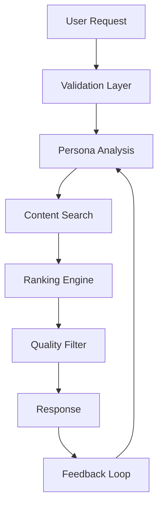

# AI Context Cheat Sheet

!!! warning "CRITICAL INFORMATION"
    This document contains essential information for AI agents working on the BAF project. Read this first before any code analysis, modification, or development.

## Project Identity

**Project Name**: BAF (BoredAF)  
**Type**: AI-powered boredom alleviation system  
**Primary Function**: Generate personalized activity suggestions  
**Core Loop**: User clicks BAF button → AI analyzes context → Returns engaging suggestion  

## Ways of Working (WoW)

### Development Principles

1. **AI-First Development** 🤖
   - Leverage AI tools for code generation, testing, and documentation
   - Always validate AI-generated code with testing
   - Use AI for code review and optimization suggestions

2. **Iterative Improvement** 🔄
   - Small, frequent deployments
   - Continuous learning from user feedback
   - A/B testing for new features

3. **Quality Over Quantity** ⭐
   - Rigorous testing before deployment
   - Code review mandatory for all changes
   - Performance optimization is non-negotiable

4. **User Privacy First** 🔒
   - All user data handling respects privacy
   - Minimal data collection principle
   - Transparent data usage policies

### Code Standards

```typescript
// Preferred patterns
interface UserPersona {
  archetypeWeights: Record<string, number>;
  moodState: MoodState;
  lastUpdated: Date;
}

// Always use TypeScript
// Always handle errors gracefully
// Always log important events
// Always validate inputs
```

### Testing Requirements

- **Unit tests**: 90%+ coverage required
- **Integration tests**: All API endpoints
- **E2E tests**: Critical user journeys
- **Performance tests**: Sub-second response times

## Global Rules

### 🚫 **NEVER DO**
- Never expose user data without consent
- Never deploy without testing
- Never hardcode API keys or secrets
- Never ignore security vulnerabilities
- Never break the core BAF button functionality

### ✅ **ALWAYS DO**
- Always validate user inputs
- Always implement error boundaries
- Always log errors for debugging
- Always optimize for mobile performance
- Always consider accessibility

### Architecture Constraints



### Core Dependencies

```json
{
  "critical": {
    "next": "^14.0.0",
    "@supabase/supabase-js": "^2.0.0",
    "openai": "^4.0.0",
    "typescript": "^5.0.0"
  },
  "optional": {
    "pgvector": "PostgreSQL extension",
    "redis": "Caching layer",
    "prisma": "ORM alternative"
  }
}
```

## System Architecture Overview

### Key Components

1. **Frontend** (`src/app/`)
   - Next.js 14 with App Router
   - TypeScript strict mode
   - Tailwind CSS for styling
   - Framer Motion for animations

2. **Backend** (`src/lib/`)
   - Supabase for database/auth
   - OpenAI API for AI processing
   - Custom ranking algorithms
   - API rate limiting

3. **AI Brain** (`src/lib/agent/`)
   - Persona management (`persona.ts`)
   - Content ranking (`ranking.ts`)
   - Circuit breaker (`circuitBreaker.ts`)
   - BAF brain logic (`bafBrain.ts`)

### Data Flow

```typescript
// Standard request flow
const handleBAFRequest = async (userId: string) => {
  // 1. Load user persona
  const persona = await loadPersona(userId);
  
  // 2. Analyze current mood/context
  const context = await analyzeContext(persona);
  
  // 3. Search for content
  const candidates = await searchContent(context);
  
  // 4. Rank and filter
  const ranked = await rankContent(candidates, persona);
  const filtered = await circuitBreaker(ranked);
  
  // 5. Return best suggestion
  return selectBestSuggestion(filtered);
};
```

## Critical Files & Their Purpose

### Core System Files

```
src/
├── app/
│   ├── components/
│   │   └── BafButton.tsx          # Main UI component
│   ├── api/
│   │   ├── baf/route.ts           # BAF API endpoint
│   │   └── auth/                  # Authentication
│   └── page.tsx                   # Main page
├── lib/
│   ├── agent/
│   │   ├── bafBrain.ts            # Main AI logic
│   │   ├── ranking.ts             # Content ranking
│   │   └── circuitBreaker.ts      # Quality filter
│   ├── persona.ts                 # User persona management
│   ├── mood.ts                    # Mood detection
│   ├── supabase.ts                # Database client
│   └── tools/                     # Content source integrations
└── __tests__/                     # Test files
```

### Configuration Files

```
├── mkdocs.yml                     # Documentation config
├── package.json                   # Dependencies
├── next.config.js                 # Next.js config
├── tailwind.config.js             # Styling config
├── tsconfig.json                  # TypeScript config
└── .env.local                     # Environment variables (DO NOT COMMIT)
```

## Environment Setup

### Required Environment Variables

```bash
# Database
NEXT_PUBLIC_SUPABASE_URL=your_supabase_url
NEXT_PUBLIC_SUPABASE_ANON_KEY=your_supabase_anon_key
SUPABASE_SERVICE_ROLE_KEY=your_service_role_key

# AI Services
OPENAI_API_KEY=your_openai_api_key

# External APIs
YOUTUBE_API_KEY=your_youtube_api_key
TWITCH_CLIENT_ID=your_twitch_client_id
TWITCH_CLIENT_SECRET=your_twitch_client_secret

# Optional
REDIS_URL=your_redis_url
ANALYTICS_API_KEY=your_analytics_key
```

### Development Commands

```bash
# Start development server
npm run dev

# Run tests
npm test

# Build for production
npm run build

# Deploy documentation
mkdocs gh-deploy --force
```

## Common Patterns & Solutions

### Error Handling Pattern

```typescript
// Standard error handling
try {
  const result = await riskyOperation();
  return { success: true, data: result };
} catch (error) {
  console.error('Operation failed:', error);
  return { success: false, error: error.message };
}
```

### API Response Pattern

```typescript
// Standard API response format
interface APIResponse<T> {
  success: boolean;
  data?: T;
  error?: string;
  metadata?: {
    timestamp: string;
    requestId: string;
    version: string;
  };
}
```

### Database Query Pattern

```typescript
// Safe database operations
const safeQuery = async (query: string, params: any[]) => {
  try {
    const { data, error } = await supabase
      .from('table_name')
      .select(query)
      .eq('column', params[0]);
    
    if (error) throw error;
    return data;
  } catch (error) {
    console.error('Database query failed:', error);
    throw error;
  }
};
```

## Testing Guidelines

### Test Structure

```typescript
describe('Component/Function Name', () => {
  beforeEach(() => {
    // Setup mocks and test data
  });

  it('should do expected behavior', () => {
    // Test implementation
  });

  it('should handle edge cases', () => {
    // Edge case testing
  });

  it('should handle errors gracefully', () => {
    // Error handling tests
  });
});
```

### Mock Patterns

```typescript
// Standard mocking pattern
jest.mock('../lib/supabase', () => ({
  supabase: {
    from: jest.fn(() => ({
      select: jest.fn(() => ({
        eq: jest.fn(() => ({
          single: jest.fn(() => ({ data: mockData, error: null }))
        }))
      }))
    }))
  }
}));
```

## Performance Optimization

### Caching Strategy

```typescript
// Multi-level caching
const cacheStrategy = {
  memory: 300,      // 5 minutes
  redis: 3600,      // 1 hour
  database: 86400,  // 24 hours
};
```

### API Rate Limiting

```typescript
// Rate limiting implementation
const rateLimits = {
  free: 3,          // 3 requests per day
  premium: 50,      // 50 requests per day
  pro: -1,          // Unlimited
};
```

## Security Considerations

### Input Validation

```typescript
// Always validate inputs
const validateInput = (input: unknown): boolean => {
  if (typeof input !== 'string') return false;
  if (input.length > 1000) return false;
  if (input.includes('<script>')) return false;
  return true;
};
```

### SQL Injection Prevention

```typescript
// Use parameterized queries
const safeQuery = 'SELECT * FROM users WHERE id = $1';
const params = [userId];
```

## Deployment Checklist

### Before Deployment

- [ ] All tests passing
- [ ] No TypeScript errors
- [ ] Environment variables set
- [ ] Database migrations applied
- [ ] Performance tests passed
- [ ] Security scan completed

### After Deployment

- [ ] Monitor error rates
- [ ] Check API response times
- [ ] Verify user functionality
- [ ] Update documentation
- [ ] Notify team of deployment

## Emergency Procedures

### System Outage

1. Check error logs in Supabase
2. Verify API keys are valid
3. Check rate limiting status
4. Restart services if needed
5. Notify users of issues

### Performance Issues

1. Check database query performance
2. Verify API rate limits
3. Check cache hit rates
4. Monitor memory usage
5. Scale resources if needed

## Quick Reference

### Common Commands

```bash
# Reset database
npm run db:reset

# Seed test data
npm run db:seed

# Run specific test
npm test -- --testNamePattern="BAF Button"

# Build documentation
mkdocs build

# Deploy docs
mkdocs gh-deploy --force
```

### Debug Commands

```bash
# Check logs
npm run logs

# Debug mode
DEBUG=* npm run dev

# Profile performance
npm run profile
```

---

!!! note "Last Updated"
    This document is maintained by the BAF development team. Update when architectural changes occur.

!!! tip "AI Agent Instructions"
    Read this document first. Ask questions if anything is unclear. Always prioritize user experience and system stability.
