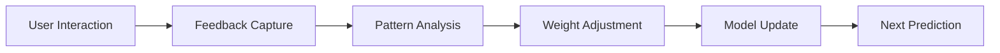

# Brain Logic Architecture

## Overview

The BAF Brain Logic is the core intelligence engine that processes user requests and generates personalized suggestions. This document details the architectural components, algorithms, and decision-making processes that power the BAF system.

## Archetypes System

### Persona-Based Content Categorization

The BAF system categorizes content into distinct archetypes that match different user preferences and contexts:

```typescript
interface Archetype {
  id: string;
  name: string;
  description: string;
  weights: ArchetypeWeights;
  triggers: string[];
  contentTypes: ContentType[];
}

interface ArchetypeWeights {
  entertainment: number;
  productivity: number;
  social: number;
  learning: number;
  creativity: number;
  relaxation: number;
}
```

### Core Archetypes

1. **The Explorer** 🗺️
   - Focus: Discovery and new experiences
   - Content: Travel vlogs, documentaries, educational content
   - Weight Profile: High learning, moderate entertainment

2. **The Creator** 🎨
   - Focus: Creative expression and skill development
   - Content: Tutorials, creative processes, skill-building
   - Weight Profile: High creativity, moderate learning

3. **The Socializer** 👥
   - Focus: Community interaction and shared experiences
   - Content: Live streams, collaborative content, social platforms
   - Weight Profile: High social, moderate entertainment

4. **The Strategist** ♟️
   - Focus: Problem-solving and strategic thinking
   - Content: Chess, strategy games, puzzles, analysis
   - Weight Profile: High productivity, moderate learning

5. **The Relaxer** 🧘
   - Focus: Stress relief and mindfulness
   - Content: Meditation, calming content, ambient experiences
   - Weight Profile: High relaxation, low stimulation

## Ranking Engine

### Multi-Factor Scoring Algorithm

The Ranking Engine evaluates content using a sophisticated multi-factor scoring system:

```typescript
interface RankingFactors {
  // Content Quality Factors
  engagementScore: number;      // Likes, views, comments ratio
  relevanceScore: number;       // Semantic similarity to user persona
  freshnessScore: number;       // Recency and timeliness
  authorityScore: number;       // Source credibility and follower count
  
  // User Preference Factors
  historicalMatch: number;       // Past interaction patterns
  moodAlignment: number;        // Current emotional state compatibility
  platformPreference: number;   // User's platform biases
  
  // System Factors
  costEfficiency: number;       // API cost vs. value ratio
  availabilityScore: number;     // Content accessibility
  diversityBonus: number;       // Encourages content variety
}
```

### Weight Calculation Formula

```typescript
const calculateFinalScore = (factors: RankingFactors, weights: ArchetypeWeights): number => {
  const baseScore = (
    factors.engagementScore * 0.25 +
    factors.relevanceScore * 0.30 +
    factors.freshnessScore * 0.15 +
    factors.authorityScore * 0.20 +
    factors.historicalMatch * 0.25 +
    factors.moodAlignment * 0.35 +
    factors.platformPreference * 0.15 +
    factors.costEfficiency * 0.10 +
    factors.availabilityScore * 0.20
  );
  
  const archetypeModifier = (
    weights.entertainment * 0.20 +
    weights.productivity * 0.15 +
    weights.social * 0.15 +
    weights.learning * 0.25 +
    weights.creativity * 0.15 +
    weights.relaxation * 0.10
  );
  
  return baseScore * (1 + archetypeModifier) + factors.diversityBonus;
};
```

### Dynamic Weight Adjustment

The system continuously adjusts weights based on:

- **User Feedback**: Positive/negative interactions modify archetype weights
- **Temporal Patterns**: Time of day and usage patterns influence scoring
- **Context Changes**: Current events and trends affect relevance
- **Performance Metrics**: System effectiveness drives optimization

## Circuit Breaker System

### Quality Assurance Mechanism

The Circuit Breaker prevents poor quality suggestions and maintains system integrity:

```typescript
interface CircuitBreakerConfig {
  minimumEngagementThreshold: number;  // Min likes/views ratio
  maximumAgeHours: number;             // Content freshness limit
  minimumAuthorityScore: number;       // Source credibility floor
  costPerSuggestionLimit: number;      // Economic efficiency ceiling
  diversityThreshold: number;          // Prevents content repetition
}
```

### Breaker Triggers

1. **Quality Filters**
   - Low engagement-to-view ratios
   - Outdated content (older than threshold)
   - Low-authority sources
   - Inappropriate content detection

2. **Economic Controls**
   - Excessive API costs per suggestion
   - Rate limiting for expensive sources
   - Cost-benefit analysis failures

3. **Diversity Enforcement**
   - Content type repetition detection
   - Source diversification requirements
   - Platform balance maintenance

4. **User Experience Guards**
   - Suggestion frequency limits
   - Error rate thresholds
   - Response time constraints

### Recovery Mechanisms

When the Circuit Breaker triggers, the system:

1. **Falls Back** to alternative content sources
2. **Adjusts Parameters** to prevent future triggers
3. **Logs Events** for analysis and improvement
4. **Notifies System** of potential issues

## Learning Loop Integration

### Feedback Processing



### Adaptive Learning

The system incorporates multiple learning mechanisms:

1. **Reinforcement Learning**: User feedback directly influences future suggestions
2. **Pattern Recognition**: Identifies usage patterns and preferences
3. **Collaborative Filtering**: Leverages similar user behavior patterns
4. **Content Analysis**: Learns from content performance metrics

### Nudge Learning Rate

The "Nudge" mechanism implements adaptive learning rates:

```typescript
const calculateLearningRate = (
  feedbackStrength: number,
  confidenceLevel: number,
  timeSinceLastInteraction: number
): number => {
  const baseRate = 0.1;
  const feedbackModifier = Math.tanh(feedbackStrength);
  const confidenceModifier = 1 - confidenceLevel;
  const timeDecay = Math.exp(-timeSinceLastInteraction / 86400); // Daily decay
  
  return baseRate * feedbackModifier * confidenceModifier * timeDecay;
};
```

## Performance Optimization

### Caching Strategy

- **Content Cache**: Frequently accessed content cached for 30 minutes
- **User Cache**: Persona data cached with 5-minute TTL
- **Embedding Cache**: Semantic search results cached for 1 hour
- **Ranking Cache**: Computed scores cached for 15 minutes

### Resource Management

- **API Rate Limiting**: Intelligent throttling across all sources
- **Batch Processing**: Groups similar requests for efficiency
- **Lazy Loading**: Loads content data on-demand
- **Connection Pooling**: Reuses database connections

### Monitoring & Analytics

- **Performance Metrics**: Response times, success rates, error rates
- **User Analytics**: Interaction patterns, satisfaction metrics
- **Cost Tracking**: API usage, operational expenses
- **Quality Metrics**: Content relevance, engagement rates

---

*This documentation is continuously updated as the system evolves.*
