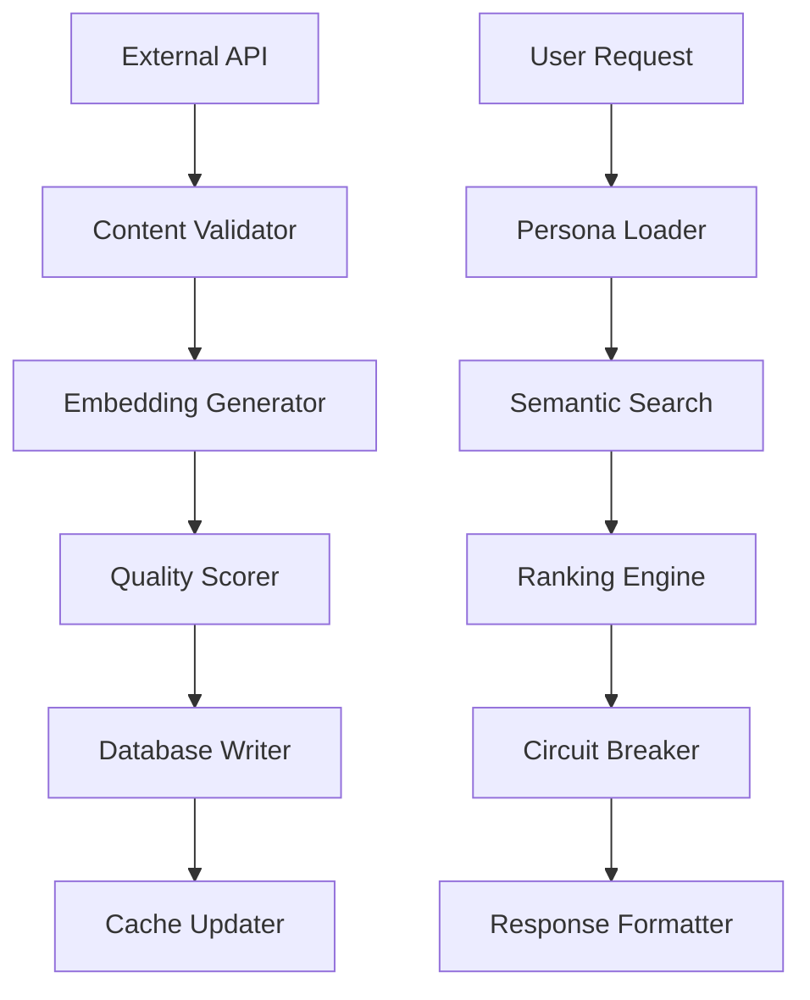

# Data Schema & Implementation

## Overview

The BAF system utilizes a sophisticated data architecture combining traditional relational databases with vector embeddings for semantic search and AI-powered content analysis. This document outlines the complete data schema, implementation details, and optimization strategies.

## Database Architecture

### Core Tables

#### Users Table
```sql
CREATE TABLE users (
    id UUID PRIMARY KEY DEFAULT gen_random_uuid(),
    email VARCHAR(255) UNIQUE NOT NULL,
    username VARCHAR(100) UNIQUE,
    created_at TIMESTAMP WITH TIME ZONE DEFAULT NOW(),
    updated_at TIMESTAMP WITH TIME ZONE DEFAULT NOW(),
    last_active TIMESTAMP WITH TIME ZONE,
    subscription_tier VARCHAR(50) DEFAULT 'free',
    api_quota_daily INTEGER DEFAULT 3,
    api_quota_used INTEGER DEFAULT 0,
    preferences JSONB DEFAULT '{}',
    is_active BOOLEAN DEFAULT true
);

CREATE INDEX idx_users_email ON users(email);
CREATE INDEX idx_users_last_active ON users(last_active);
CREATE INDEX idx_users_subscription ON users(subscription_tier);
```

#### Personas Table
```sql
CREATE TABLE personas (
    id UUID PRIMARY KEY DEFAULT gen_random_uuid(),
    user_id UUID REFERENCES users(id) ON DELETE CASCADE,
    archetype_weights JSONB NOT NULL,
    mood_state JSONB DEFAULT '{}',
    interaction_history JSONB DEFAULT '[]',
    learning_data JSONB DEFAULT '{}',
    created_at TIMESTAMP WITH TIME ZONE DEFAULT NOW(),
    updated_at TIMESTAMP WITH TIME ZONE DEFAULT NOW(),
    version INTEGER DEFAULT 1
);

CREATE INDEX idx_personas_user_id ON personas(user_id);
CREATE INDEX idx_personas_updated_at ON personas(updated_at);
```

#### Content Pool Table
```sql
CREATE TABLE content_pool (
    id UUID PRIMARY KEY DEFAULT gen_random_uuid(),
    source_type VARCHAR(50) NOT NULL, -- 'youtube', 'twitch', 'chess', 'tiktok', 'custom'
    source_id VARCHAR(255) NOT NULL,
    title TEXT NOT NULL,
    description TEXT,
    metadata JSONB DEFAULT '{}',
    embedding vector(1536), -- OpenAI embedding dimension
    engagement_metrics JSONB DEFAULT '{}',
    quality_score DECIMAL(3,2) DEFAULT 0.5,
    created_at TIMESTAMP WITH TIME ZONE DEFAULT NOW(),
    updated_at TIMESTAMP WITH TIME ZONE DEFAULT NOW(),
    expires_at TIMESTAMP WITH TIME ZONE,
    is_active BOOLEAN DEFAULT true
);

CREATE INDEX idx_content_pool_source ON content_pool(source_type);
CREATE INDEX idx_content_pool_quality ON content_pool(quality_score);
CREATE INDEX idx_content_pool_expires ON content_pool(expires_at);
CREATE INDEX idx_content_pool_embedding ON content_pool USING ivfflat (embedding vector_cosine_ops);
```

#### User Interactions Table
```sql
CREATE TABLE user_interactions (
    id UUID PRIMARY KEY DEFAULT gen_random_uuid(),
    user_id UUID REFERENCES users(id) ON DELETE CASCADE,
    content_id UUID REFERENCES content_pool(id) ON DELETE CASCADE,
    interaction_type VARCHAR(50) NOT NULL, -- 'view', 'like', 'share', 'dismiss', 'accept'
    feedback_score INTEGER CHECK (feedback_score >= -1 AND feedback_score <= 1),
    context JSONB DEFAULT '{}',
    created_at TIMESTAMP WITH TIME ZONE DEFAULT NOW()
);

CREATE INDEX idx_interactions_user_id ON user_interactions(user_id);
CREATE INDEX idx_interactions_content_id ON user_interactions(content_id);
CREATE INDEX idx_interactions_type ON user_interactions(interaction_type);
CREATE INDEX idx_interactions_created_at ON user_interactions(created_at);
```

#### Suggestions Table
```sql
CREATE TABLE suggestions (
    id UUID PRIMARY KEY DEFAULT gen_random_uuid(),
    user_id UUID REFERENCES users(id) ON DELETE CASCADE,
    content_id UUID REFERENCES content_pool(id) ON DELETE CASCADE,
    ranking_score DECIMAL(5,4),
    context JSONB DEFAULT '{}',
    algorithm_version VARCHAR(20),
    created_at TIMESTAMP WITH TIME ZONE DEFAULT NOW(),
    responded_at TIMESTAMP WITH TIME ZONE,
    response_type VARCHAR(50)
);

CREATE INDEX idx_suggestions_user_id ON suggestions(user_id);
CREATE INDEX idx_suggestions_created_at ON suggestions(created_at);
CREATE INDEX idx_suggestions_ranking ON suggestions(ranking_score);
```

## pgvector Implementation

### Vector Embedding Setup

```sql
-- Enable pgvector extension
CREATE EXTENSION IF NOT EXISTS vector;

-- Create embedding index for efficient similarity search
CREATE INDEX idx_content_embeddings 
ON content_pool 
USING ivfflat (embedding vector_cosine_ops) 
WITH (lists = 100);

-- Create index for user persona embeddings (if stored)
CREATE INDEX idx_persona_embeddings 
ON personas 
USING ivfflat (embedding vector_cosine_ops) 
WITH (lists = 50);
```

### Semantic Search Queries

```sql
-- Find similar content based on embedding similarity
SELECT 
    id, 
    title, 
    source_type,
    quality_score,
    1 - (embedding <=> '[0.1,0.2,0.3,...]'::vector) as similarity_score
FROM content_pool 
WHERE is_active = true 
    AND expires_at > NOW()
ORDER BY embedding <=> '[0.1,0.2,0.3,...]'::vector 
LIMIT 20;

-- Hybrid search combining semantic and metadata filters
SELECT 
    cp.id,
    cp.title,
    cp.source_type,
    cp.quality_score,
    1 - (cp.embedding <=> $1::vector) as semantic_score,
    (cp.engagement_metrics->>'likes')::integer as likes,
    (cp.engagement_metrics->>'views')::integer as views
FROM content_pool cp
WHERE cp.source_type = ANY($2)
    AND cp.quality_score >= $3
    AND cp.is_active = true
ORDER BY 
    (1 - (cp.embedding <=> $1::vector)) * 0.7 + 
    cp.quality_score * 0.3 DESC
LIMIT $4;
```

## Data Flow Architecture

### Content Ingestion Pipeline



### Data Models

#### Content Metadata Structure
```typescript
interface ContentMetadata {
  source: {
    platform: string;
    id: string;
    url: string;
    author: string;
    publishedAt: string;
  };
  engagement: {
    views: number;
    likes: number;
    comments: number;
    shares: number;
    duration?: number;
  };
  classification: {
    categories: string[];
    tags: string[];
    language: string;
    contentRating: string;
  };
  technical: {
    format: string;
    resolution?: string;
    bitrate?: number;
    fileSize?: number;
  };
}
```

#### Persona Data Structure
```typescript
interface PersonaData {
  archetypeWeights: {
    entertainment: number;
    productivity: number;
    social: number;
    learning: number;
    creativity: number;
    relaxation: number;
  };
  moodState: {
    current: string;
    intensity: number;
    context: string;
    timestamp: string;
  };
  preferences: {
    platforms: Record<string, number>;
    contentTypes: Record<string, number>;
    timePreferences: Record<string, number>;
  };
  history: {
    recentInteractions: InteractionRecord[];
    successfulSuggestions: ContentReference[];
    rejectedContent: ContentReference[];
  };
}
```

## The "Nudge" Learning Rate Implementation

### Adaptive Learning Algorithm

The Nudge system implements sophisticated learning rate adjustment based on multiple factors:

```typescript
class NudgeLearningRate {
  private baseRate: number = 0.1;
  private momentum: number = 0.9;
  private decayRate: number = 0.95;
  
  calculateOptimalRate(
    feedbackStrength: number,
    confidenceLevel: number,
    timeSinceLastInteraction: number,
    userEngagementTrend: number
  ): number {
    // Adaptive base rate based on user engagement
    const engagementModifier = Math.tanh(userEngagementTrend);
    const adaptiveBase = this.baseRate * (1 + engagementModifier);
    
    // Feedback strength modifier (stronger feedback = higher learning rate)
    const feedbackModifier = Math.tanh(feedbackStrength);
    
    // Confidence modifier (lower confidence = higher learning rate)
    const confidenceModifier = 1 - confidenceLevel;
    
    // Time decay (recent interactions get higher weight)
    const timeDecay = Math.exp(-timeSinceLastInteraction / 86400); // Daily decay
    
    // Calculate final learning rate
    const learningRate = adaptiveBase * 
                        feedbackModifier * 
                        confidenceModifier * 
                        timeDecay;
    
    // Apply momentum for stability
    return this.applyMomentum(learningRate);
  }
  
  private applyMomentum(newRate: number): number {
    // Implement momentum-based smoothing
    return this.momentum * this.currentRate + (1 - this.momentum) * newRate;
  }
}
```

### Learning Rate Scheduling

```sql
-- Track learning rate effectiveness
CREATE TABLE learning_metrics (
    id UUID PRIMARY KEY DEFAULT gen_random_uuid(),
    user_id UUID REFERENCES users(id),
    learning_rate DECIMAL(5,4),
    feedback_strength DECIMAL(3,2),
    prediction_accuracy DECIMAL(3,2),
    created_at TIMESTAMP WITH TIME ZONE DEFAULT NOW()
);

-- Analyze learning rate effectiveness
SELECT 
    learning_rate,
    AVG(feedback_strength) as avg_feedback,
    AVG(prediction_accuracy) as avg_accuracy,
    COUNT(*) as sample_size
FROM learning_metrics 
WHERE created_at > NOW() - INTERVAL '7 days'
GROUP BY learning_rate
ORDER BY avg_accuracy DESC;
```

## Performance Optimization

### Database Indexing Strategy

```sql
-- Composite indexes for common query patterns
CREATE INDEX idx_interactions_user_content 
ON user_interactions(user_id, content_id, interaction_type);

CREATE INDEX idx_content_quality_source 
ON content_pool(quality_score DESC, source_type, is_active);

CREATE INDEX idx_suggestions_user_ranked 
ON suggestions(user_id, ranking_score DESC, created_at DESC);

-- Partial indexes for better performance
CREATE INDEX idx_active_high_quality 
ON content_pool(id) 
WHERE is_active = true AND quality_score >= 0.7;

CREATE INDEX idx_recent_interactions 
ON user_interactions(user_id, created_at DESC) 
WHERE created_at > NOW() - INTERVAL '30 days';
```

### Caching Layer

```typescript
interface CacheStrategy {
  // Content cache with TTL
  contentCache: {
    ttl: 1800; // 30 minutes
    maxSize: 10000;
    evictionPolicy: 'LRU';
  };
  
  // User persona cache
  personaCache: {
    ttl: 300; // 5 minutes
    maxSize: 1000;
    evictionPolicy: 'LRU';
  };
  
  // Embedding search results cache
  searchCache: {
    ttl: 3600; // 1 hour
    maxSize: 5000;
    evictionPolicy: 'LFU';
  };
}
```

### Query Optimization

```sql
-- Optimized content recommendation query
WITH user_context AS (
  SELECT 
    p.archetype_weights,
    p.mood_state,
    ARRAY_AGG(ui.content_id ORDER BY ui.created_at DESC LIMIT 50) as recent_content
  FROM personas p
  LEFT JOIN user_interactions ui ON p.user_id = ui.user_id
  WHERE p.user_id = $1
  GROUP BY p.id, p.archetype_weights, p.mood_state
),
candidate_content AS (
  SELECT 
    cp.*,
    1 - (cp.embedding <=> $2::vector) as semantic_similarity
  FROM content_pool cp
  WHERE cp.is_active = true
    AND cp.expires_at > NOW()
    AND cp.quality_score >= 0.5
    AND NOT cp.id = ANY((SELECT recent_content FROM user_context))
  ORDER BY semantic_similarity DESC
  LIMIT 100
)
SELECT 
  cc.*,
  cc.semantic_similarity * 0.7 + cc.quality_score * 0.3 as final_score
FROM candidate_content cc
ORDER BY final_score DESC
LIMIT 10;
```

## Data Governance & Privacy

### Data Retention Policies

```sql
-- Automatic cleanup of old interaction data
DELETE FROM user_interactions 
WHERE created_at < NOW() - INTERVAL '90 days';

-- Archive old suggestions
DELETE FROM suggestions 
WHERE created_at < NOW() - INTERVAL '30 days' 
  AND responded_at IS NULL;

-- Content expiration
UPDATE content_pool 
SET is_active = false 
WHERE expires_at < NOW();
```

### Privacy Compliance

```typescript
interface PrivacyControls {
  dataMinimization: {
    collectOnlyNecessary: boolean;
    automaticDeletion: boolean;
    retentionPeriod: number; // days
  };
  
  userRights: {
    dataPortability: boolean;
    deletionRequest: boolean;
    consentManagement: boolean;
  };
  
  security: {
    encryptionAtRest: boolean;
    encryptionInTransit: boolean;
    accessLogging: boolean;
  };
}
```

---

*This schema evolves with the system. Check version history for changes.*
