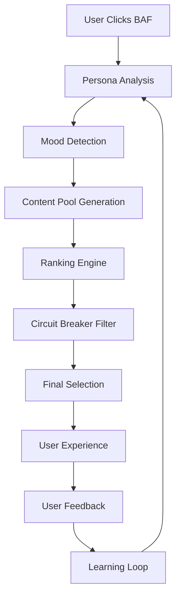

# BAF (BoredAF) Developer Portal

## Project Vision

BAF (BoredAF) is an intelligent boredom alleviation system that leverages AI to provide personalized, contextually relevant suggestions when users are experiencing boredom. The system combines sophisticated persona modeling, content ranking algorithms, and real-time data sources to deliver engaging activities and experiences.

## The BAF Button Concept

At its core, BAF operates around a simple yet powerful interaction: **The BAF Button**. When a user clicks the BAF button, the system:

1. **Analyzes Context**: Examines user's current mood, historical preferences, and available data
2. **Generates Suggestions**: Leverages multiple AI agents to find relevant activities
3. **Ranks & Filters**: Applies sophisticated algorithms to ensure quality and relevance
4. **Delivers Experience**: Presents the user with engaging, personalized content

## High-Level System Flow

### Core Components

- **Persona Engine**: Maintains user preferences and behavioral patterns
- **Mood Detection**: Analyzes current emotional state and context
- **Content Sources**: Aggregates from YouTube, Twitch, Chess, TikTok, and custom sources
- **Ranking Algorithm**: Multi-factor scoring system for content relevance
- **Circuit Breaker**: Prevents poor quality suggestions and maintains system integrity

## Key Features

### 🎯 **Personalization**
- Dynamic persona adaptation based on user interactions
- Mood-aware content recommendations
- Learning from feedback loops

### 🔄 **Multi-Platform Integration**
- YouTube videos and streams
- Twitch live content
- Chess games and puzzles
- TikTok content
- Custom activity suggestions

### 🧠 **AI-Powered Intelligence**
- Semantic search and embeddings
- Real-time content analysis
- Adaptive learning algorithms

### 💰 **Sustainable Economics**
- Cost-per-click optimization
- Partner program integration
- Premium feature monetization

## Architecture Overview

The BAF system is built on a modern, scalable architecture:

- **Frontend**: Next.js with responsive design
- **Backend**: Node.js with TypeScript
- **Database**: PostgreSQL with pgvector for embeddings
- **AI/ML**: OpenAI API for content generation and analysis
- **Infrastructure**: Cloud-native with automated deployment

## Development Philosophy

### Ways of Working

1. **AI-First Development**: Leverage AI tools for code generation, testing, and documentation
2. **Iterative Improvement**: Continuous learning and adaptation based on user feedback
3. **Quality Over Quantity**: Rigorous testing and validation of all components
4. **Performance Optimization**: Efficient resource usage and fast response times

### Global Rules

- **User Privacy First**: All data handling respects user privacy and consent
- **Content Quality**: Rigorous filtering to ensure appropriate and engaging content
- **System Reliability**: Built-in redundancy and error handling
- **Cost Efficiency**: Optimized API usage and resource management

## Getting Started

This documentation portal provides comprehensive guides for understanding, developing, and deploying the BAF system. Navigate through the sections to learn about:

- [Brain Logic](brain-logic.md) - Deep dive into the core algorithms
- [Data Schema](data-schema.md) - Database structure and implementation
- [Economics Model](economics.md) - Monetization and cost analysis
- [AI Context](ai-context.md) - Essential information for AI agents

---

*Last updated: 2024-03-25*
